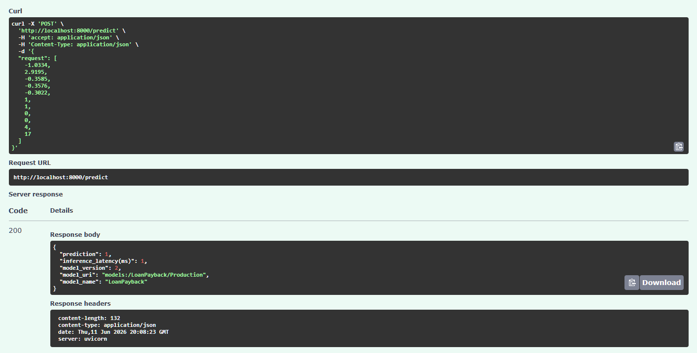
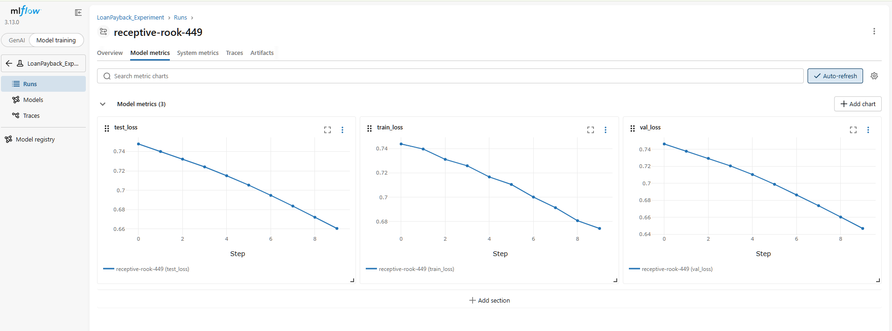

# Credit Risk Inference System

An end-to-end MLOps system for real-time credit risk classification, covering model training, experiment tracking, containerized deployment, and CI/CD automation on AWS.

---

## What It Does

Predicts the probability that a borrower will default on a loan (binary classification). The system is designed for production use, with sub-500ms inference, automated model promotion, and a full local development stack.

---

## Architecture Overview

```
Training Pipeline → MLflow Registry → FastAPI Inference API → AWS EC2 (via ECR)
     │                    │                   │
  PyTorch NN          PostgreSQL           Docker
  11 features           + S3               + IAM
```

**Stack:** PyTorch · FastAPI · MLflow · PostgreSQL · MinIO · Docker · GitHub Actions · AWS (EC2, ECR, S3, IAM)



---

## Model

The model is a fully connected feedforward neural network built in PyTorch, trained on 11 engineered loan features for binary default classification. All experiments are tracked with MLflow, which stores run metadata in PostgreSQL and artifacts in S3. Promising runs are registered to the MLflow Model Registry and promoted to the `Production` stage, which the inference service uses to load the right model at startup.

## Inference API

The inference layer is a FastAPI service that pulls the current Production model from the registry at boot and serves real-time predictions over REST. The service is containerized with Docker and deployed to AWS EC2 via ECR. Under load testing with `wrk`, p99 latency measured at **450ms**.

## CI/CD Pipeline

Deployments are automated with a GitHub Actions workflow (`deploy.yaml`). On every push, the runner authenticates with AWS, builds and pushes a fresh Docker image to ECR, then SSHes into the EC2 instance and hot-swaps the running container — no manual steps required.

## Local Development

The full system runs locally via Docker Compose, spinning up Postgres, MinIO, MLflow, the training job, and the inference API together. Docker Compose is used instead of individual `docker run` commands because it handles passing AWS credentials into the containers and wiring up the connections to S3 and the Postgres metadata store.

---

## Running Locally

**Start the full stack:**
```bash
docker compose up
```

**Build and run just the inference API:**
```bash
docker build -f api/inference.dockerfile -t inference .
docker run --env-file .env -p 8000:8000 -d inference
```

---

## AWS Deployment

The EC2 instance runs with an IAM role scoped to least-privilege. The `mlflow_s3_access` custom policy restricts S3 access to the MLflow artifacts bucket only.

| Policy | Purpose |
|---|---|
| `AmazonEC2ContainerRegistryPullOnly` | Pull images from ECR |
| `AmazonEC2ContainerRegistryReadOnly` | Read ECR metadata |
| `mlflow_s3_access` (custom) | `s3:GetObject` + `s3:ListBucket` on MLflow artifact bucket |

---

## Future Work

Planned improvements include canary/blue-green deployments for zero-downtime model updates, an Auto Scaling Group for horizontal scaling under load, and an Application Load Balancer in front of the EC2 fleet.